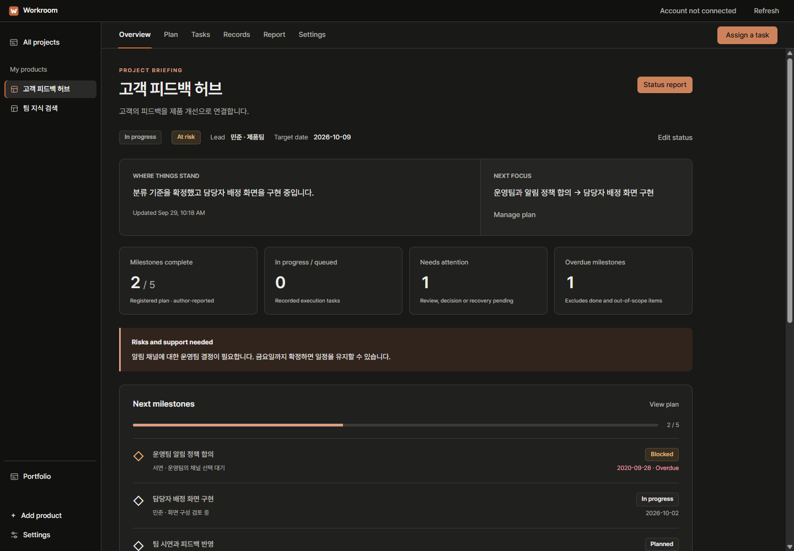
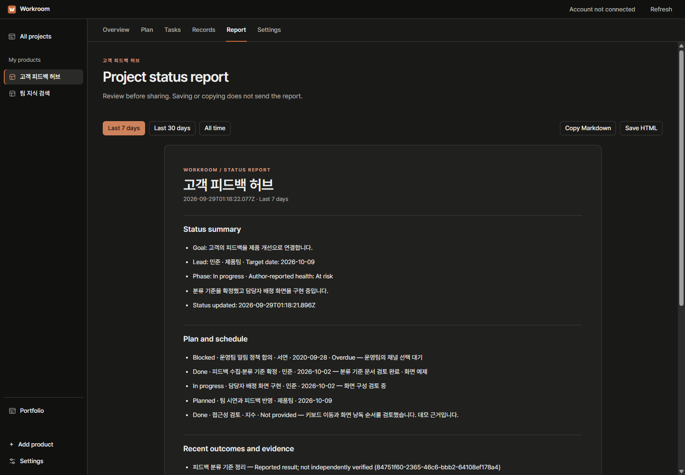
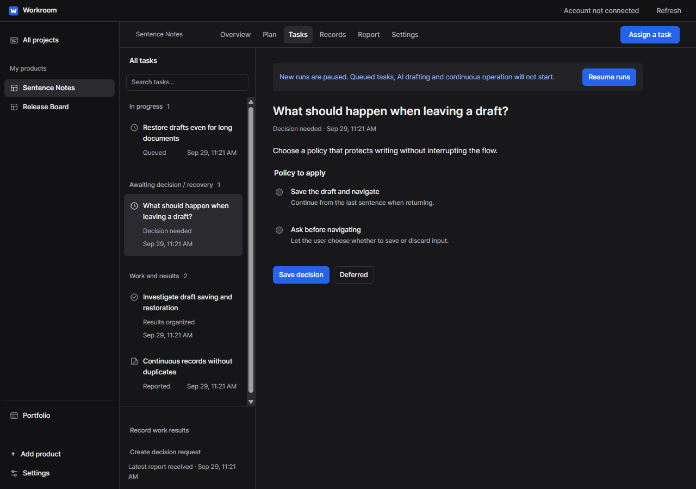
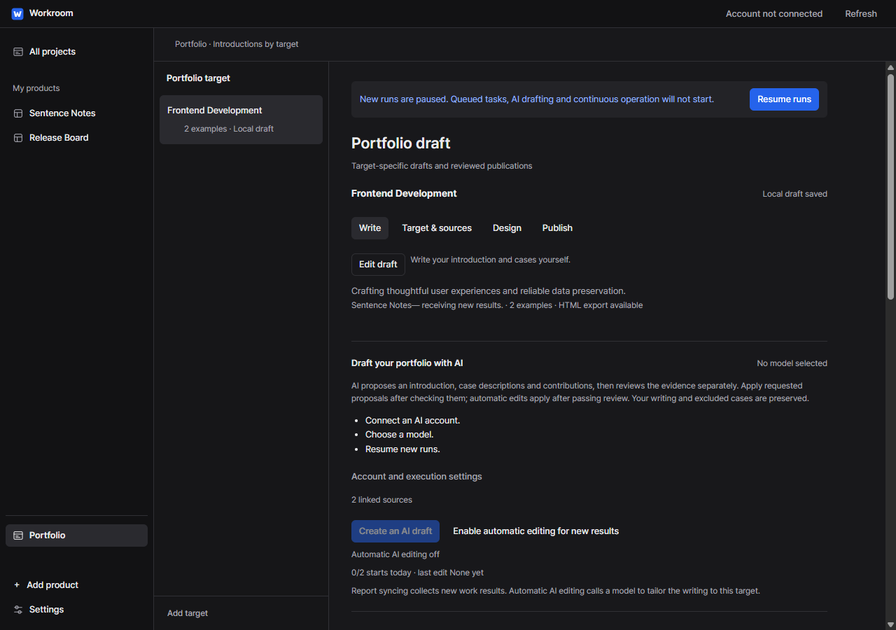
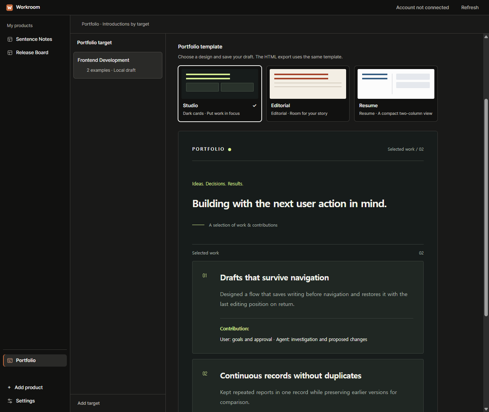
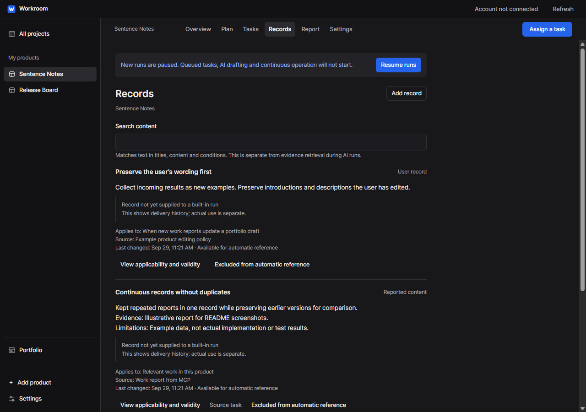

<p align="center">
  
</p>

<h1 align="center">Workroom · 작업실</h1>

<p align="center"><a href="README.md">한국어</a> · <strong>English</strong></p>

<p align="center">
  <strong>Turn assigned work into results, and results into your own record.</strong><br>
  A local desktop app for project status, plans, development results and shareable progress reports.
</p>

<p align="center">
  <a href="#current-status"></a>
  <a href="#getting-started"></a>
  <a href="#connect-your-tools"></a>
  <a href="LICENSE"></a>
</p>

<p align="center">
  <a href="#getting-started">Get started</a> ·
  <a href="#a-look-inside">Screenshots</a> ·
  <a href="#connect-your-tools">Connect your tools</a> ·
  <a href="https://github.com/tttaliesin/workroom/issues">Report an issue</a>
</p>



<p align="center"><sub>All screenshots are captured from the actual Electron app in dark mode. Products, tasks and portfolio content are illustrative examples.</sub></p>

## The next step in development, in one place

Connect a product folder and a goal, then describe the work you want done. The built-in agent investigates, prepares changes and runs an independent review. Reviewed results become records for future work and examples for portfolio drafts tailored to each target.

| Flow | What Workroom does |
| :--- | :--- |
| **Status and planning** | Track leads, dates, status and risks. Link milestones to actual tasks and prepare Markdown or HTML progress reports for your team. |
| **Work and review** | Connects investigation, proposed changes, before/after checks and independent review. Inspect the results and diff before applying changes to the source. |
| **Records and evidence** | Keeps sources and applicability together. The built-in agent and MCP use the same records. |
| **Experience and introduction** | Adds new results to target-specific drafts. Preserves your edits, exports standalone HTML and optionally publishes reviewed content through Vercel. |

## Getting started

Requires **Node.js 24+ and pnpm**. Workroom currently runs from source and is primarily tested on Windows.

```sh
git clone https://github.com/tttaliesin/workroom.git
cd workroom
pnpm install --ignore-scripts
node node_modules/electron/install.js
pnpm start
```

On Windows, you can also launch `start-workroom.cmd` after installation.

Open **Settings → General → Interface language** at the bottom left and choose **English** or **한국어**. Changes apply immediately and persist across launches. Your records keep their original text. Save or discard unsaved form changes before opening settings. This changes Workroom's interface; existing reports, model responses and the external Codex terminal are not automatically translated.

1. **Connect a product folder** — Select a development folder and describe your goal.
2. **Assign a task** — Describe the result you want, then choose **Investigate first** or **Prepare changes too**.
3. **Connect an account** — Connect your ChatGPT account and select a model to run the saved request.
4. **Review and apply** — Inspect the diff, checks and review, then apply the reviewed version to the source.

Workroom starts empty. You can prepare requests before signing in, browse existing records and use MCP collection without connecting the built-in agent account.

## A look inside

### Project status you can present to your team

**All projects** compares health updates, overdue milestones and tasks that need attention. Each project's **Overview** brings together its goal, lead, target date, current status, next steps and milestones.

Use **Plan** to maintain status updates and milestones with owners, due dates, progress, blockers and linked work evidence. Done and blocked milestones require notes. Completion is based on registered milestones and is author-reported; it does not prove checks passed, source changes were applied or deployment completed.

Under **Report**, review the last 7 days, 30 days or all recorded outcomes, risks and next steps. **Copy Markdown / Save HTML** exports the exact previewed version without sending anything externally.



Planning and reporting work without a built-in AI account and use the same contracts through MCP. Owners are display names. Team accounts, access roles and online collaborative editing are not available yet. Existing projects start without invented plans or owners: add them under **Plan**.

### Keep decisions visible

See work in progress separately from tasks that need your judgment. Open a task to review the policy choices and their effects.



### Turn work results into your introduction

Choose the experience to emphasize for each target and collect new results in a draft. Automatic updates preserve wording you edited and examples you excluded. Review the content before saving it as standalone HTML.

Under **Write**, edit the draft yourself or **Create an AI draft**. Account, model, target priorities and work evidence requirements are shown before execution. Return to the same target after account setup. AI proposes an introduction, case descriptions and contributions, then reviews the evidence separately.



**Target & sources** holds job sources and cases; **Design** holds templates; **Publish** handles HTML export and Vercel publication. Report syncing collects work results. Automatic AI editing calls a model to tailor the writing, and shows why it is waiting when setup is incomplete.



Choose **Studio · Editorial · Resume** under **Design**, then **Save draft**. Save dark cards, an editorial layout, or a compact two-column resume for each target. Save or discard pending edits before switching sections. Preview and HTML share the same design; exported files work offline and include print styles.

Design references: [DevPortfolio](https://github.com/RyanFitzgerald/devportfolio) and [minimalist CV](https://github.com/BartoszJarocki/cv). See [Third-party notices](THIRD_PARTY_NOTICES.md#portfolio-design-references) for attribution.

<details>
<summary><strong>Explore reusable records and their sources</strong></summary>

Each record includes applicability, sources and delivery history. The built-in agent and MCP share the same retrieval service. When linked file evidence changes, a record is withheld until it is rechecked.



</details>

## Connect your tools

The built-in runner uses [Pi](https://www.npmjs.com/package/@earendil-works/pi-coding-agent). External MCP clients can query the same products and records and report work results. Codex hooks can collect responses that involved file changes or check commands.

**You can also operate Workroom from Codex through MCP:** register products, answer decisions, start/stop/resume AI work, configure automation, edit portfolios and publish. Review changes and checks in Codex, then request application or publication of that exact version. No separate approval screen in the app is required.

If Workroom is closed, call `workroom_control_connect` with `start:true` to start the executor without opening a window. App actions, both MCP interfaces, automatic collection and scheduling share a command boundary. Prepare a review package, submit your assessment with `review.submit`, record an execution decision with `review.decide`, then execute using the saved review and decision IDs. A review hash alone is not approval. `external.submit` accepts proposed file contents and base hashes, runs actual checks in isolated copies and permits reviewed application without a built-in AI account. Request IDs retain results across retries; uncertain effects are reconciled against evidence instead of blindly repeated. Protocol 2 is required; an older running app needs a normal restart before reconnecting. [MCP workflow and command contract](MCP.md)

App-wide settings live under **Settings** at the bottom left: **AI runs** (Workroom AI account, model and pause), **External tools** (letting external tools read and edit records, run tasks, review and apply results) and **Publishing account** (the Vercel token for portfolio publishing). Product-specific settings are in each product’s **Settings** tab. To report work yourself, use **Record work result / Create decision request** below the **Work** list.

To connect Codex:

1. In **Settings → External tools**, **Check environment and connection** — Discover Codex and Node.js 24+, or select their executables.
2. **Review MCP registration → Register MCP in Codex** — Preserve other settings and back up the existing file.
3. **Run connection check** — Verify the MCP tool list and product data access.
4. In the product’s **Settings → Automatic Codex work collection**, **Review connection settings → Save connection settings for this product** — Install the product hooks while preserving existing hooks.
5. On the same screen, **Open Codex approval screen** — Complete any sign-in and project trust prompts, then open **Hook approval (/hooks)**. Review and trust the three `작업실 수집` (Workroom collection) hooks using the arrow keys and Enter.
6. Close the Codex window and **Recheck approval status**. The next completed task involving file changes or checks will update the collection status.

You do not need to edit configuration files or open a separate terminal. Initial account authentication uses Codex's official browser flow. Existing Codex chats may not immediately load new settings; verify in a new task. Closing the embedded Codex window ends that process, so wait for any work to finish first.

Generic stdio settings for other MCP clients are available in **Settings → External tools → Other MCP clients · Recent record changes → View connection settings**. Workroom and the MCP server use the same local SQLite data.

Command results are validated against **contractVersion 1**. Check that **liveConnection, compatible and contractCompatible** are all true in `workroom_control_connect`. An invalid result or completion-storage failure leaves the request `uncertain`; inspect effects using the original request ID before taking further action. Seeing tools in a list does not establish executor connectivity. [Connection refresh and recovery](MCP.md#연결-갱신과-확인)

### Use alongside Jev Context

Workroom manages work and results; [Jev Context](https://github.com/tttaliesin/jev-context) manages long-term memory. **Register each app's MCP server independently in Codex or Claude Desktop.** The agent can read Workroom results and use Jev's memory tools when needed. There is no direct connection or transfer screen between the apps.

Registering both servers does not automatically save memories. User requests or explicit agent instructions determine what to remember and when. Repositories, databases and releases stay separate, and either app works on its own. For example: “Read this Workroom result and remember its key decisions and limitations in Jev, including its source and reported status.”

## Where does the data stay?

Records and settings are stored locally in `.workroom/` by default. The built-in agent's credentials are encrypted using OS-protected storage. Semantic retrieval and reranking run on the local CPU; public model files are downloaded on first use.

The built-in agent sends investigation and change requests to the connected model. Not every AI feature works offline. Set `WORKROOM_DATA_DIR` to move the data; back it up by copying the whole folder after closing the app and the MCP server. The agent's file tools are limited to registered product folders.

## Current status

**Local alpha · 0.1** — The product name is provisional, and the workflow is being refined through use.

- **Available:** Product and goal management, agent investigation and proposed changes, independent review, decision records, reusable knowledge retrieval, target-specific portfolios, HTML export, MCP connection and Korean/English interface switching.
- **Optional:** Periodic investigations, bounded retries, linked decision resume, npm dependency installation and verification profiles, tray execution, versioned job sources, and reviewed Vercel portfolio publication, verification and restoration.
- **Not yet available:** Execution after the app process exits, remote execution, an installer or automatic updates. Live Vercel deployment still needs validation with your account.

Closing the window exits by default. Enable tray execution in **Settings → General** to keep running, then use **Quit Workroom** in the tray to stop.

**Latest local validation · 2026-09-29:** **134 unit/integration tests** and **18 actual Electron app checks** passed, along with lint and formatting checks. An actual MCP client and Electron executor in an isolated profile completed reading → external submission → Node checks → review and decision → source application → result retrieval without a built-in AI account. Checks cover matching app/MCP contracts and errors, duplicate prevention after result-validation or persistence failure, concurrent requests, lost responses and recovery after actual process termination. Partial-application interruption points and publication provider responses were simulated. These results do not establish connectivity in your current Codex conversation, live paid-model calls or Vercel account deployment. Verify the current connection separately.

The latest cleanup removes a circular dependency in verification, reduces redundant persisted state and automatically cleans up temporary profiles after successful checks.

## Help improve Workroom

Report the screen involved and steps to reproduce in an [issue](https://github.com/tttaliesin/workroom/issues). For code changes, run:

```sh
pnpm test
pnpm check:app
pnpm lint
pnpm format:check
```

App checks use isolated example data. Temporary directories are deleted after successful checks and retained on failure for diagnosis. Set `WORKROOM_KEEP_FIXTURES=1` when you need the example databases for comparisons of rendered HTML.

README screenshots are recaptured from example data with `pnpm docs:screenshots` (`--english` for English). [How to capture (Korean)](assets/readme/README.md)

## License

[MIT](LICENSE). See [Third-party notices](THIRD_PARTY_NOTICES.md) for Pretendard, Radix Colors, models and other external components.

<p align="center"><sub>Electron · SQLite · Pi · MCP</sub></p>
