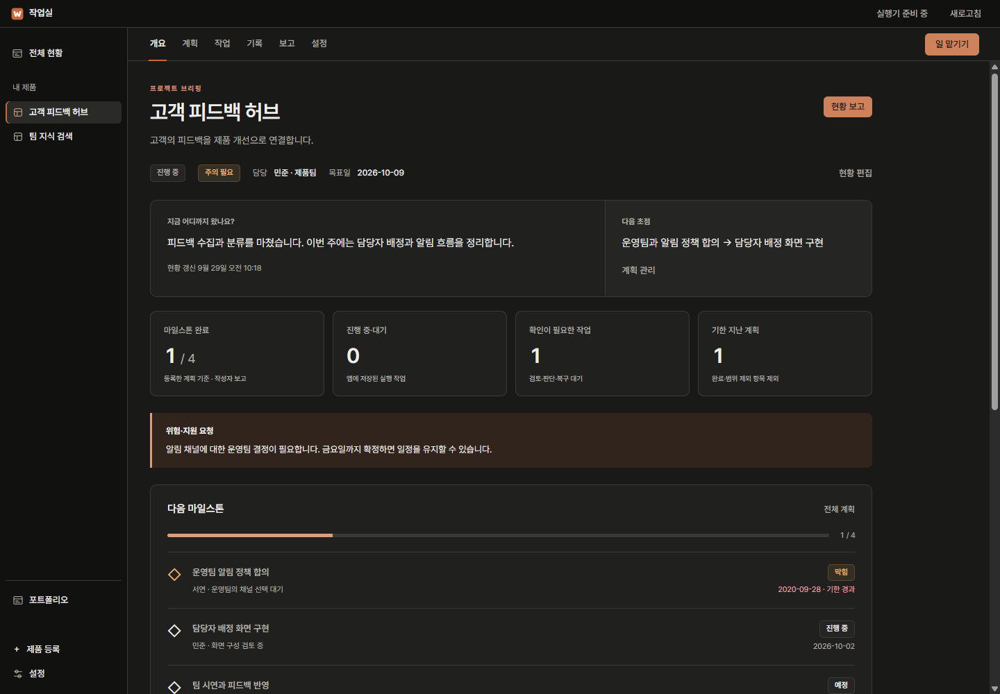
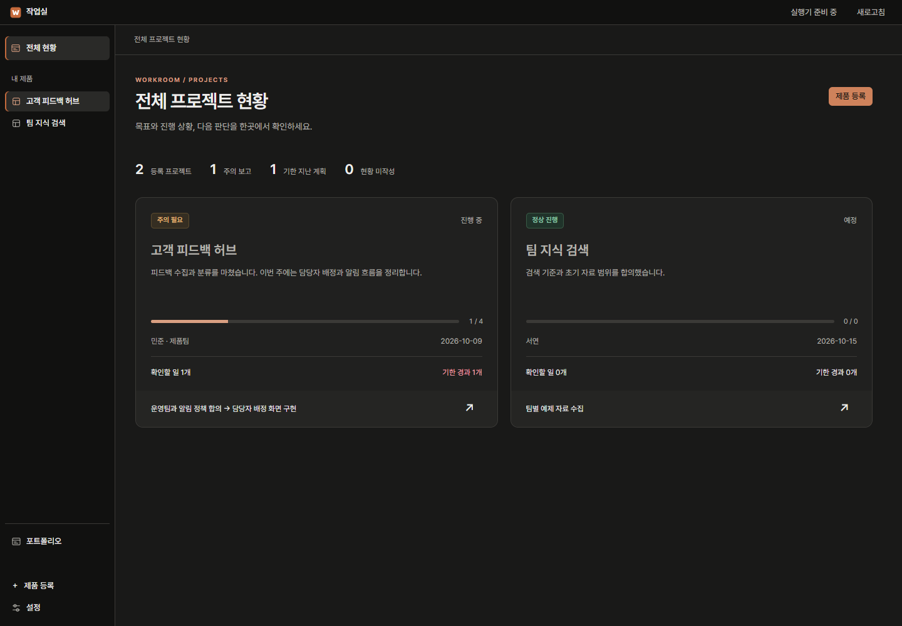
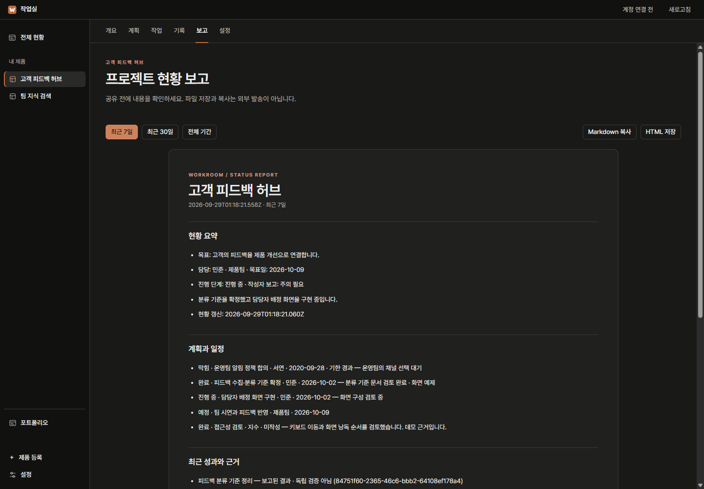
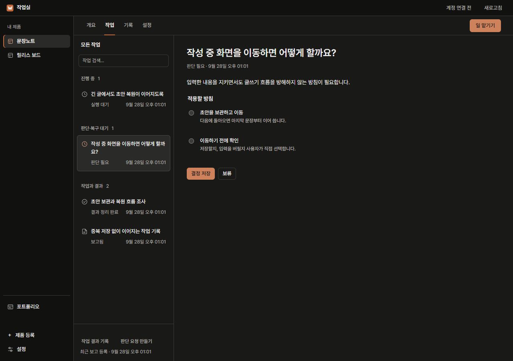
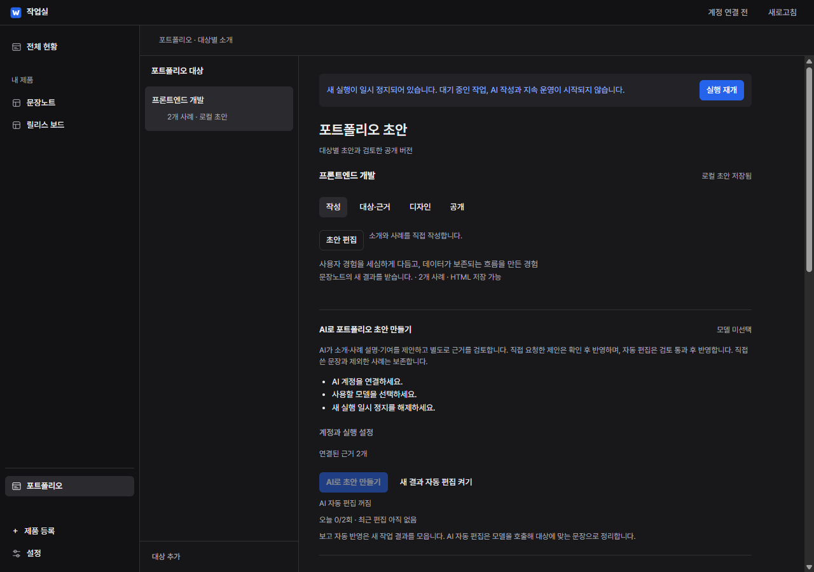
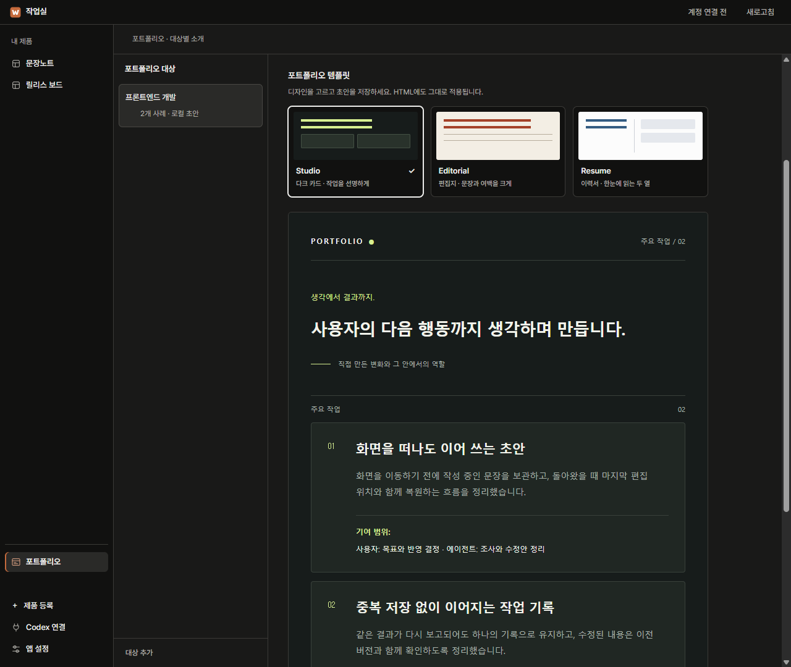
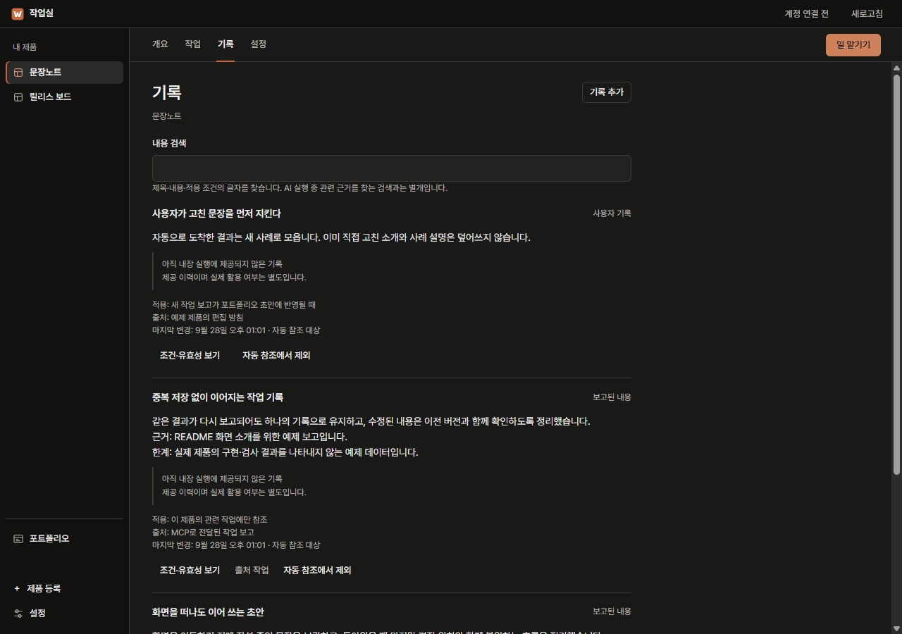

<p align="center">
  
</p>

<h1 align="center">작업실 · Workroom</h1>

<p align="center"><strong>한국어</strong> · <a href="README.en.md">English</a></p>

<p align="center">
  <strong>맡긴 일은 결과로, 쌓인 결과는 나의 기록으로.</strong><br>
  프로젝트 현황과 계획, 개발 결과와 공유용 보고서를 함께 관리하는 로컬 데스크톱 앱.
</p>

<p align="center">
  <a href="#현재-단계"></a>
  <a href="#시작하기"></a>
  <a href="#내-도구와-연결하기"></a>
  <a href="LICENSE"></a>
</p>

<p align="center">
  <a href="#시작하기">시작하기</a> ·
  <a href="#화면-둘러보기">화면 둘러보기</a> ·
  <a href="#내-도구와-연결하기">내 도구와 연결하기</a> ·
  <a href="https://github.com/tttaliesin/workroom/issues">문제 제보</a>
</p>



<p align="center"><sub>모든 스크린샷은 실제 Electron 앱의 다크 모드에서 촬영했습니다. 제품·작업·포트폴리오 내용은 소개용 예제입니다.</sub></p>

## 개발의 다음 단계가 한곳에

제품 폴더와 목표를 연결하고, 원하는 일을 맡기세요. 내장 에이전트가 조사와 수정안 작성, 별도 검토를 이어갑니다. 확인한 결과는 다음 작업에 쓸 기록으로 남고, 지원 대상에 맞춘 포트폴리오 초안으로 모입니다.

| 흐름 | 작업실이 하는 일 |
| :--- | :--- |
| **현황과 계획** | 프로젝트별 담당자·목표일·현황·위험을 관리하고 마일스톤에 작업 근거를 연결합니다. 팀에 공유할 Markdown·HTML 보고서를 만듭니다. |
| **작업과 검토** | 조사 → 수정안 → 수정 전후 검사 → 별도 검토를 연결합니다. 결과와 변경 내용을 확인하고 원본에 반영합니다. |
| **기록과 근거** | 출처와 적용 조건을 함께 저장합니다. 내장 에이전트와 MCP가 같은 기록을 조회합니다. |
| **경험과 소개** | 제품의 새 결과를 대상별 초안에 모읍니다. 직접 다듬은 문장은 보존하고 HTML로 내보내거나, Vercel을 연결해 검토한 내용을 공개합니다. |

## 시작하기

**Node.js 24 이상과 pnpm**이 필요합니다. 현재는 소스에서 실행하며, Windows에서 주로 확인했습니다.

```sh
git clone https://github.com/tttaliesin/workroom.git
cd workroom
pnpm install --ignore-scripts
node node_modules/electron/install.js
pnpm start
```

Windows에서는 설치 후 `start-workroom.cmd`로도 열 수 있습니다.

왼쪽 아래 **설정 → 일반 → 화면 언어**에서 **한국어 / English**를 선택할 수 있습니다. 선택은 바로 적용되고 다음 실행에도 유지됩니다. 기존 기록의 원문은 보존하며, 작성 중인 내용이 있으면 저장하거나 취소한 뒤 설정으로 이동합니다.

1. **제품 등록** — 개발 폴더를 선택하고 이루고 싶은 목표를 적습니다.
2. **일 맡기기** — 원하는 결과를 쓰고 **먼저 조사** 또는 **수정안까지 작성**을 고릅니다.
3. **계정 연결** — ChatGPT 계정과 모델을 연결해 보관한 요청을 실행합니다.
4. **검토 후 반영** — 변경 전후 코드와 검사·검토 결과를 확인하고, 검토한 버전을 원본에 적용합니다.

처음에는 빈 작업실로 시작합니다. 로그인 전에도 요청을 작성해 둘 수 있고, 기존 기록 열람과 MCP 수집을 사용할 수 있습니다.

## 화면 둘러보기

### 팀에 설명할 수 있는 프로젝트 현황

**전체 현황**에서 프로젝트명·상태·담당자·목표일·마일스톤 완료·확인할 일을 표에서 비교하세요. 프로젝트 **개요**는 현황·위험·다음 단계와 오른쪽 속성을 나누어 보여줍니다. 작은 창에서는 속성이 본문 위로 이동하며, 계획이 없으면 **계획 미등록**으로 표시합니다.



**계획**에서 현황 편집이나 마일스톤 추가를 열고, 저장·취소로 편집을 마칩니다. 담당자, 기한, 진행·막힘·완료·범위 제외를 관리하고 실제 작업을 근거로 연결할 수 있습니다. 완료와 막힘에는 메모가 필요합니다. 완료율은 등록한 마일스톤 기준의 작성자 보고이며, 코드 검사·반영·배포 완료를 뜻하지 않습니다.

**보고**에서 최근 7일·30일·전체 기간의 성과, 위험, 후속 계획을 검토하고 **Markdown 복사 / HTML 저장**으로 공유 자료를 만드세요. 내보내기는 미리 본 버전을 유지하며 외부로 자동 전송하지 않습니다.



이 기능은 내장 AI 계정 없이 사용하며 MCP에서도 같은 계약으로 관리합니다. 담당자는 표시용 이름입니다. 팀 계정·권한 관리나 온라인 공동 편집은 아직 제공하지 않습니다. 기존 프로젝트의 계획과 담당자는 임의 추정하지 않으므로 **계획**에서 처음 작성해야 합니다.

### 필요한 판단을 놓치지 않게

진행 상황과 사용자 판단이 필요한 일을 구분해 보여줍니다. 작업을 열면 방침과 선택에 따른 영향을 확인할 수 있습니다.



### 작업 결과를 나의 소개로

지원 대상마다 강조할 경험을 정하고 새 결과를 초안에 모읍니다. 자동으로 갱신해도 직접 고친 문장과 제외한 사례는 보존합니다. 공개할 내용을 검토한 뒤 독립 HTML로 저장할 수 있습니다.

**작성**에서 직접 **초안 편집**을 하거나 **AI로 초안 만들기**를 선택하세요. AI 실행에 필요한 계정·모델·강조점·작업 근거가 먼저 표시되며, 계정 설정 후 같은 대상으로 돌아올 수 있습니다. AI는 소개·사례 설명·기여를 작성하고 근거를 별도로 검토합니다.



**대상·근거**는 공고 원문과 사례를, **디자인**은 템플릿을, **공개**는 HTML 내보내기와 Vercel 공개를 관리합니다. 보고 자동 반영은 작업 결과를 모으는 기능이고, AI 자동 편집은 모델로 문장을 정리하는 기능입니다. 자동 편집을 켜도 준비가 부족하면 이유와 함께 대기 상태를 표시합니다.



포트폴리오 **디자인**에서 **Studio · Editorial · Resume** 중 하나를 고르고 **초안 저장**을 누르세요. 다크 카드형, 편집지형, 두 열 이력서형을 대상별로 저장합니다. 미저장 편집이 있으면 먼저 저장하거나 취소한 뒤 화면을 이동합니다. 미리보기와 HTML은 같은 디자인을 사용하고, 내보낸 파일은 인터넷 없이 열거나 인쇄할 수 있습니다.

디자인은 [DevPortfolio](https://github.com/RyanFitzgerald/devportfolio)와 [미니멀 CV](https://github.com/BartoszJarocki/cv)를 참고했습니다. 자세한 출처는 [Third-party notices](THIRD_PARTY_NOTICES.md#portfolio-design-references)에 정리했습니다.

<details>
<summary><strong>재사용할 기록과 출처도 살펴보기</strong></summary>

기록마다 적용 조건, 출처, 제공 이력을 확인할 수 있습니다. 내장 에이전트와 MCP는 공통 검색을 사용하고, 연결된 파일 근거가 바뀐 기록은 재확인할 때까지 제공을 보류합니다.



</details>

## 내 도구와 연결하기

**MCP 안에 일반 작업 시나리오를 포함한 지침 v2가 들어 있습니다.** 등록된 프로젝트에서 “이 버그 고쳐줘”, “이 조사 결과 정리해줘”라고 요청하면 시작 시 맥락 조회, 의미 있는 작업 종료 시 결과 기록과 근거 있는 현황 갱신을 하도록 안내합니다. 별도 Skill 없이 `workroom_guide`로 한영 지침을 읽을 수 있습니다. 잡담·미등록 폴더·기록 거부는 제외합니다. 일반 파일 수정은 Codex·Claude에서 수행하며 Workroom 수정안 절차를 다시 거치지 않습니다.

Codex 훅이 MCP 보고의 요청 ID를 확인하면 구조화 보고와 훅 요약을 연결해 중복 성과 집계에서 제외합니다. 같은 턴의 서로 다른 문제와 원본 근거는 유지하며 사용자 편집 문장을 덮어쓰지 않습니다. **v2 지침에 따른 양쪽 실제 대화의 자발적 기록은 아직 미검증**입니다. 기존 연결은 어댑터·실행기를 함께 갱신하고, 훅은 다시 설치한 뒤 변경된 정의를 Codex에서 신뢰해야 합니다. [일반 작업·실행 연결·제외 조건](MCP.md#일반-작업의-기본-행동)

Claude Desktop용 JSON은 **설정 → 외부 도구 → 다른 MCP 클라이언트 연결 → 연결 설정 보기 → MCP 설정 복사**에서 가져와 개발자 설정의 기존 `mcpServers`에 병합합니다. Codex와 동일한 실행 파일·서버·자료 폴더를 사용합니다. [클라이언트 연결과 지침 사용법](MCP.md)

연결 진단은 MCP 어댑터와 실행기를 구분합니다. `ADAPTER_OUTDATED`는 클라이언트 MCP 연결을 갱신하고, `EXECUTOR_OUTDATED`는 진행 중 작업·미저장 입력을 확인한 뒤 실행기를 갱신합니다. `expectedDataDirectory`로 의도한 프로필을 확인할 수 있습니다. **MCP 연결만으로 대화가 자동 수집되지는 않습니다.** 자동 수집은 별도 Codex 훅 설정이며 Claude 대화 수집은 포함하지 않습니다.

내장 실행기는 [Pi](https://www.npmjs.com/package/@earendil-works/pi-coding-agent)를 사용합니다. 외부 MCP 클라이언트도 같은 제품과 기록을 조회하고 작업 결과를 보고할 수 있습니다. Codex 훅을 연결하면 파일 변경·검사가 있었던 응답을 작업 기록으로 수집할 수 있습니다.

**Codex에서 Workroom의 실행도 제어할 수 있습니다.** 제품 등록, 판단 답변, AI 작업 시작·중지·재개, 자동화 설정, 포트폴리오 편집과 공개를 MCP로 요청합니다. 변경·검사 결과를 Codex에서 검토하고 같은 버전의 원본 반영이나 공개를 요청하면 됩니다. 별도 앱 승인 화면은 필요 없습니다.

앱이 꺼져 있으면 `workroom_control_connect`의 `start:true`로 창 없이 실행기를 시작합니다. 앱과 MCP는 같은 실행 규칙과 요청 이력을 사용합니다. **검토 자료 → 검토 의견 → 실행 결정**을 저장해 정확한 버전에 연결하며, 해시만으로 실행하지 않습니다. `external.submit`으로 보낸 수정안은 내장 AI 계정 없이 분리된 복사본에서 검사하고 Codex 검토 뒤 반영할 수 있습니다. 내장 AI 개발 뒤 외부 검토를 원하면 `reviewMode:"external"`을 사용합니다. 업데이트 전부터 켜져 있던 앱은 정상 종료 후 다시 실행하고 MCP도 재연결하세요. [MCP 사용 흐름과 protocol 2 계약](MCP.md)

왼쪽 아래 **설정 → 외부 도구**에서 실행 환경을 확인하고 MCP를 등록한 뒤 **실제 연결 검사**로 서버와 제품 데이터를 확인하세요. 작업 자동 수집은 제품마다 **제품 설정 → Codex 작업 자동 수집**에서 켜고, 같은 화면에서 Codex 훅을 승인합니다. 설정 파일을 직접 편집하거나 별도 터미널을 열 필요가 없습니다.

앱 전체에 적용되는 설정은 왼쪽 아래 **설정**에 모여 있습니다. **AI 실행**은 Workroom AI의 계정·모델·일시 정지를, **외부 도구**는 외부 도구에서 기록 조회·편집과 작업 실행·검토·반영을 요청하는 연결을, **공개 계정**은 포트폴리오 공개에 쓰는 Vercel 토큰을 다룹니다. 제품별 설정은 제품의 **설정** 탭에 있습니다. 직접 보고하려면 **작업** 목록 아래의 **작업 결과 기록 / 판단 요청 만들기**를 사용하세요.

명령별 결과는 **contractVersion 1**로 검증합니다. `workroom_control_connect`의 **liveConnection · compatible · contractCompatible**이 모두 true인지 확인하세요. 결과 형식이나 완료 저장에 문제가 생기면 요청을 `uncertain`으로 남기므로, 새 요청으로 반복하지 말고 기존 요청 ID로 효과를 확인합니다. 도구 목록이 보이는 것만으로 실행기 연결이 확인되지는 않습니다. [연결 갱신과 오류 복구](MCP.md#연결-갱신과-확인)

### Jev Context와 함께 사용하기

Workroom은 작업과 결과를, [Jev Context](https://github.com/tttaliesin/jev-context)는 장기 기억을 관리합니다. **각 앱의 MCP를 Codex 또는 Claude Desktop에 독립적으로 연결**하면 에이전트가 Workroom의 결과를 읽고, 필요한 내용을 Jev에 기억시키거나 조회할 수 있습니다. 두 앱 사이에 별도 연결이나 전송 화면은 없습니다.

두 MCP를 등록하는 것만으로 자동 기억되지는 않습니다. 저장 시점과 범위는 사용자 요청이나 에이전트 작업 지침으로 정합니다. 저장소·DB·배포는 계속 분리되며 각 앱을 단독으로 사용할 수 있습니다.

## 데이터는 어디에 남나요?

기록과 설정은 기본적으로 내 컴퓨터의 `.workroom/`에 저장합니다. 로그인 정보는 운영체제 보호 저장소로 암호화합니다. 기록의 의미 검색과 재정렬은 로컬 CPU에서 실행하며, 첫 사용 때 공개 모델 파일을 다운로드합니다.

내장 에이전트의 조사·수정에는 연결한 모델로 요청을 보냅니다. 모든 AI 기능이 오프라인으로 실행되는 앱은 아닙니다. 데이터 위치는 `WORKROOM_DATA_DIR`로 바꿀 수 있으며, 백업은 앱과 MCP를 종료한 뒤 데이터 폴더를 통째로 복사하세요. 에이전트의 파일 도구는 등록한 제품 폴더 안으로 제한됩니다.

## 현재 단계

**Local alpha · 0.1** — 제품 이름은 임시이며, 직접 사용하면서 흐름을 다듬고 있습니다.

- **사용 가능**: 제품과 목표 관리, 에이전트 조사·수정안·별도 검토, 판단 기록, 재사용 지식 검색, 대상별 포트폴리오와 HTML 내보내기, MCP 연결, 한국어·영어 UI 전환.
- **선택 기능**: 주기적 조사와 허용된 수정안 작성, 제한된 실패 재시도, 판단 답변 후 연결 작업 재개, npm 의존성 설치·검사 프로필, 트레이 실행, 공고 원문 버전 보관, 검토한 포트폴리오의 Vercel 공개·상태 확인·이전 내용 복원.
- **아직 없음**: 앱 프로세스가 종료된 동안의 실행, 원격 실행, 인스톨러와 자동 업데이트. Vercel의 실제 계정 배포는 사용자 환경에서 확인해야 합니다.

기본은 창을 닫으면 종료됩니다. **설정 → 일반**에서 트레이 실행을 켜면 창을 닫아도 계속 진행하며, 트레이의 **완전히 종료**로 멈춥니다.

**지침 v2 실제 연결 적용 · 2026-09-30**: 현재 Codex의 실제 MCP 연결에서 지침 v2와 최신 실행기의 계약·자료 경로 일치, 제어 준비 상태를 확인했습니다. 기존 프로젝트 훅을 검토·설치하고, Claude의 일반 연결 설정과 양쪽 격리 검증 연결을 준비했습니다. 훅 신뢰 승인, Claude의 연결 갱신, 새 대화의 자발적 기록과 실제 호스트 훅 연결 검증은 남아 있습니다. 실행 중 다른 사용자 작업은 종료하지 않았습니다.

**지침 v2 자동 검증 · 2026-09-29**: 격리된 실제 stdio MCP에서 일반 파일 수정의 검사 실패→통과, 보고 수정·저장 확인, 기존 담당·일정·위험을 보존한 현황 갱신을 확인했습니다. 합성 훅 이벤트의 도착 순서·재전송·출처 충돌·별개 문제 보존과 실제 프로세스 종료 후 복구도 통과했습니다. 이는 실제 Codex·Claude 대화의 자발적 사용 성공을 뜻하지 않습니다.

**이전 지침 v1 MCP 검증 · 2026-09-29**: 실제 Codex 대화의 MCP 도구로 지침 조회 → 격리 수정안 제출 → 실제 Node 검사 → 외부 검토·결정 → 원본 반영 → 저널·파일 해시 대조를 완료했습니다. 내장 AI 계정 없이 현황·마일스톤 저장과 고정 보고서 조회·파일 저장도 수행했습니다. 실행기 연결이 한 번 끊겨 재접속 후 요청 미접수를 확인하고 같은 ID로 이어갔으며, 종료 원인은 미확인입니다. Claude Desktop에서는 지침·프롬프트 표시와 모델의 안내 도구 선택까지 확인했고 **도구 사용 승인 이후 전체 업무는 미검증**입니다. 별도 stdio·Electron 회귀는 중복·응답 유실·실제 프로세스 중단·부분 효과 복구를 포함하며, 부분 반영 중단 지점과 공개 제공자는 모의 조건입니다. 실제 대화 성공과 SDK 검사 성공을 구분하며 유료 API 호출·실제 공개 배포는 수행하지 않았습니다.

최근 정리에서는 검사 실행기의 순환 의존과 중복 저장 상태를 줄이고, 성공한 테스트의 임시 프로필이 자동으로 정리되도록 바꿨습니다.

## 함께 다듬기

문제가 생긴 화면과 재현 순서를 [이슈](https://github.com/tttaliesin/workroom/issues)에 남겨 주세요. 코드 변경 전에는 아래 검사를 실행할 수 있습니다.

```sh
pnpm test
pnpm check:app
pnpm lint
pnpm format:check
```

앱 검사는 격리된 예제 데이터를 사용합니다. 성공한 검사의 임시 폴더는 자동 삭제하고, 실패한 검사는 진단을 위해 보존합니다. 화면 HTML 비교 등에 예제 DB가 필요하면 `WORKROOM_KEEP_FIXTURES=1`로 실행하세요.

앱 화면은 [Linear의 2026년 UI 개편](https://linear.app/now/behind-the-latest-design-refresh)을 주 기준으로, 파란 브랜드와 중립색 선택 상태를 사용합니다. 공개 포트폴리오는 기존 세 가지 템플릿을 유지합니다.

README 스크린샷은 `pnpm docs:screenshots`(영어는 `--english`)로 예제 데이터에서 다시 촬영합니다. [촬영 방법](assets/readme/README.md)

## 라이선스

[MIT](LICENSE). Pretendard, 사용 모델 등 외부 구성 요소는 [Third-party notices](THIRD_PARTY_NOTICES.md)를 참고하세요.

<p align="center"><sub>Electron · SQLite · Pi · MCP</sub></p>
